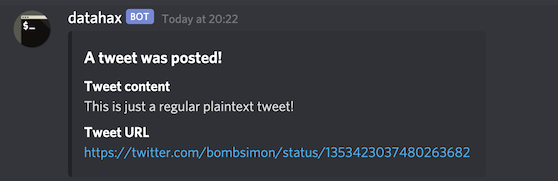
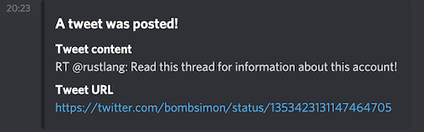
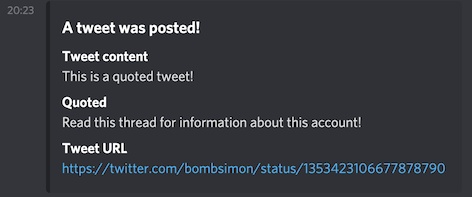
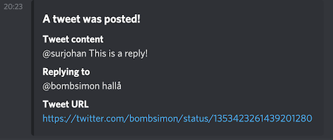

# Tweets to Discord

This is a bot I made to stream a Twitter feed and post updates to Discord. It
was initially named `runar-tweets-to-discord` since the idea behind this was to
ensure all posts posted by [Runar Devik
Søgaard](https://twitter.com/RunarSogaard) would end up in our discord server in
real time. However, after finishing the implementation I realised this could be
used for anyone.

Currently, this only supports a single user feed to follow. It will post all
mesages (mentions and replies).

## Usage

Edit the configuration file and run it.

```sh
% cargo run [my_config.yaml]
...
[2021-01-24T19:21:44Z INFO  tweets_to_discord] starting stream, watching Simpa Lainään
[2021-01-24T19:22:57Z TRACE tweets_to_discord] tweet received in stream
[2021-01-24T19:22:57Z INFO  tweets_to_discord] @bombsimon: This is just a regular plaintext tweet! (https://twitter.com/bombsimon/status/1353423037480263682)
[2021-01-24T19:22:57Z TRACE tweets_to_discord] sent message to 111111111111111111 successfully
[2021-01-24T19:23:13Z TRACE tweets_to_discord] tweet received in stream
[2021-01-24T19:23:13Z INFO  tweets_to_discord] @bombsimon: This is a quoted tweet! (https://twitter.com/bombsimon/status/1353423106677878790)
[2021-01-24T19:23:14Z TRACE tweets_to_discord] sent message to 111111111111111111 successfully
[2021-01-24T19:23:19Z TRACE tweets_to_discord] tweet received in stream
[2021-01-24T19:23:19Z INFO  tweets_to_discord] @bombsimon: RT @rustlang: Read this thread for information about this account! (https://twitter.com/bombsimon/status/1353423131147464705)
[2021-01-24T19:23:19Z TRACE tweets_to_discord] sent message to 111111111111111111 successfully
[2021-01-24T19:23:50Z TRACE tweets_to_discord] tweet received in stream
[2021-01-24T19:23:50Z INFO  tweets_to_discord] @bombsimon: @surjohan This is a reply! (https://twitter.com/bombsimon/status/1353423261439201280)
[2021-01-24T19:23:51Z TRACE tweets_to_discord] sent message to 111111111111111111 successfully
```

### Output

This is what the result will look like.

**Plaintext**



**Retweet**



**Quote**



**Reply**


